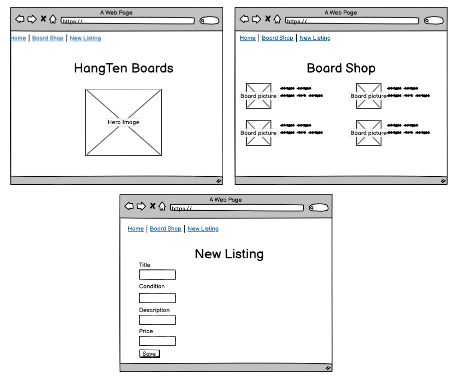
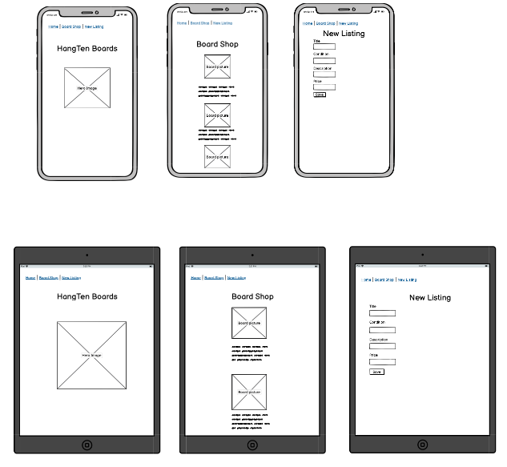

# README

## Purpose - R7
Hang Ten Boards is a market place where people can buy and sell new or used surfboards. It a perfect place for beginners taking up the sport, people looking to sell old boards to make room and provides a central spot where like minded surfing enthusiats can come to buy and sell boards. 
## Key benefits - R8
- It provides a central spot for people looking to buy or sell boards in time for summer and Christmas. 
- Begginners can purchase used boards to learn on which provides a cheaper entry point into the sport
- Convieneit way to earn extra money buy selling old boards
- Online marketplace accessible anywhere within Australia

## Website - https://hangtenboards.herokuapp.com/ - R9

## Github Repository - https://github.com/lgunds6/HangTen - R10

## Marketplace Overview - R11

### Purpose
Hang Ten Boards is a market place where people can buy and sell new or used surfboards. It a perfect place for beginners taking up the sport, people looking to sell old boards to make room and provides a central spot where like minded surfing enthusiats can come to buy and sell boards. 

### Functionality
Hang Ten Boards is a two sided marketplace. 
- It allows users to visit the board shop to see which items are availabe to purchase. 
- Users can search through the availbe items for sale and can easily make a purchase using Strip as its payment gateway. 
- It allows users to create an account and sell their new or used surfboards. 
- The marketplace only allows the original user of the listing to make edit to the item
- The app allows a user to upload images of the surfboard allowing customerrs to clearly see the item before buying it.

### Sitemap

### Application screenshots

### Target Audience
- Surfing enthusiasts
- People looking to sell new and old boards
- Beginner surfers

### Tech Stack
- HTML
- CSS
- Bootstrap - 5.1.3
- Ruby on Rails - 6.1.4.1
- Deployment - Heroku
- Image service - AWS S3
- Payment Gateway - Stripe
- DB - PostgreSQL

## User Stories - R12
Please see trello board link below for user stories.
Trello board: https://trello.com/b/6n6BAtbQ/t2a2-market-place

## Wireframes - R13

## ERD - R14

I have included a dotted line from the board image line to the active storage table as there is no connection within the data base but active stroage manages the files that are uploaded and stored within AWS.

## High-Level Components - R15
The high-level components of Hang Ten Boards are ass follows:
- Boards controller will speak to the User model to authenticate current user or allow  user to login or sign up. When a user is createing a new listing the boards controller will speak to the boards model to validate the parameters before adding to the database. When a user views a board the boards controller will speak to the boards model which will ask the DB to fetch the boards data and feed this  data to the controller. The controller will pass this info to the correct view.

## Third Party Services - R16
- Deployement - Heroku
- Image service - AWS S3
- Payment gateway - Strip

## Models and relationships - R17
-  User.rb model has_many relationship with the Board.rb model as a user can own many boards.
- The Board.rb has a belongs_to relationship with User.rb model as each board must belong to one user. Board.rb also can connect to active storage with a has_one_attached image.

## Database relations - R18
We have two database tables used in the application. One table for boards and one table for users. These tables are joined using the user id. Every user from the user table will have a user id which is the primary key, this user id is the foreign key to a board/s within the boards table joining the user and board/s together. 

## Datacse schema - R19
Please see ERD above. 

## Project tracking - R20
I have created user stories based on all actions a user can perform within the app. Each user story has a checklist of features/sstylings/steps that must be ticked off before that user story can move to test. Once the alll tests  have been completed the user story moves to completed.
If the user story has a dependency this is added in the checklist along with the dependency user story to ensure they are test together.  
Please see trello board link below for a detailed view of all user stories.

Trello: https://trello.com/b/6n6BAtbQ/t2a2-market-place

## System dependencies
- gem 'aws-sdk-s3', '~> 1.105'
- gem 'bootstrap', '~> 5.1.3'
- gem 'devise'
- gem 'jquery-rails'
- gem 'stripe', '~> 5.41'
- Rails 6.1.4.1P
- Ruby 2.7.2 or higher
- Database - PostgreSQL
